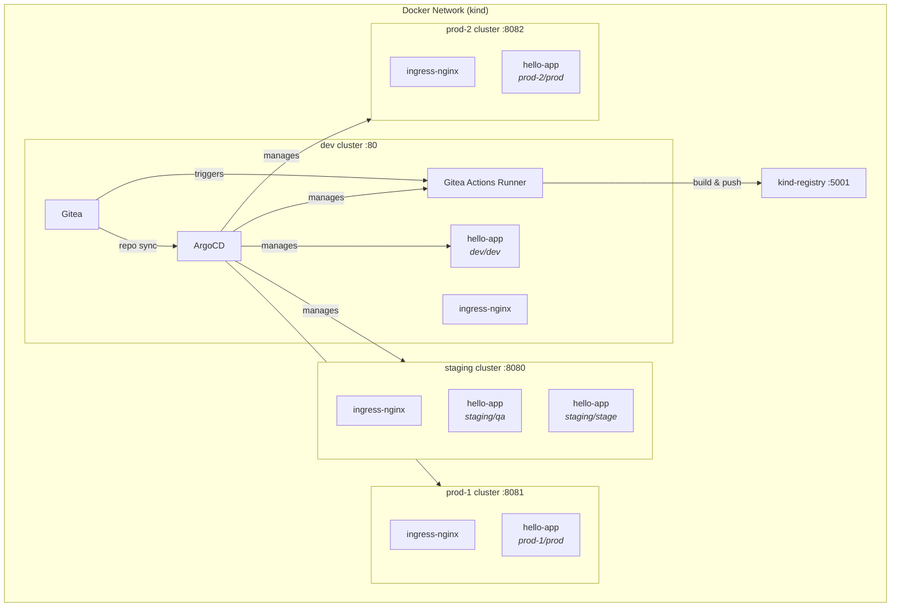

# IDP — Internal Developer Platform

A local multi-cluster GitOps platform running on [kind](https://kind.sigs.k8s.io/), managed by [ArgoCD](https://argo-cd.readthedocs.io/).

## Quick Start

```bash
make run      # create clusters, install infra, activate GitOps
make status   # show platform status
make clean    # tear everything down
```

## Architecture



Four kind clusters simulate a real multi-cluster environment:

| Cluster   | Role                           | Port    |
| --------- | ------------------------------ | ------- |
| `dev`     | Hub — runs ArgoCD, Gitea + Actions runner | `:80`   |
| `staging` | Remote — stage + qa namespaces | `:8080` |
| `prod-1`  | Remote — prod namespace        | `:8081` |
| `prod-2`  | Remote — prod namespace        | `:8082` |

ArgoCD on the dev cluster manages all clusters. Gitea hosts the git repos that ArgoCD watches.

## Repository Structure

```
.
├── scripts/                # Operational scripts
│   ├── run.sh              # Full setup (terraform → bootstrap → GitOps)
│   ├── clean.sh            # Full teardown (terraform destroy)
│   ├── build.sh            # Build and push a project image
│   ├── status.sh           # Platform status
│   ├── sync-projects.sh    # Push repos to Gitea
│   └── utils.sh            # Shared config and helpers
│
├── terraform/              # Infrastructure as code
│   ├── clusters/           # Root module: Docker network, registry, Kind clusters
│   ├── repositories/       # Root module: Gitea repositories
│   └── modules/            # Reusable modules
│       ├── kind-cluster/   # Single Kind cluster + containerd registry config
│       └── gitea-repository/ # Single Gitea repository
│
├── infrastructure/         # Shared infra definitions (managed by ArgoCD)
│   ├── argocd/             # ArgoCD Helm chart
│   ├── gitea/              # Gitea Helm chart + runner token secret
│   ├── gitea-actions/      # Gitea Actions runner + DinD sidecar
│   ├── ingress-nginx/      # Ingress controller
│   ├── argocd-manager/     # Remote cluster SA + RBAC
│   └── registry/           # Local registry ConfigMap
│
├── bootstrap/              # One-shot infra per cluster (applied by run.sh)
│   ├── dev/                # ArgoCD + Gitea + ingress-nginx + registry + cluster secrets
│   ├── staging/            # argocd-manager + ingress-nginx + registry
│   ├── prod-1/             # argocd-manager + ingress-nginx + registry
│   └── prod-2/             # argocd-manager + ingress-nginx + registry
│
├── applicationsets/        # ArgoCD ApplicationSet declarations
│   ├── applicationsets.yaml  # Root Application (tracks this directory)
│   ├── gitea-actions.yaml    # List generator for the Actions runner
│   └── hello-app.yaml       # Git directory generator for hello-app
│
├── apps/                   # App base manifests (never applied directly)
│   └── hello-app/          # Deployment, Service, Ingress
│
├── clusters/               # Per-target overlays (ArgoCD's source of truth)
│   ├── dev/dev/hello-app/
│   ├── staging/stage/hello-app/
│   ├── staging/qa/hello-app/
│   ├── prod-1/prod/hello-app/
│   └── prod-2/prod/hello-app/
│
├── projects/               # Application source code
│   └── hello-app/          # Go app + Dockerfile + CI workflow
│
└── Makefile
```

## How It Works

### Setup Flow (`make run`)

0. **Terraform** — provision Docker network, registry, and 4 Kind clusters
1. **Secrets** — generate placeholder `.env` files for cluster credentials and a runner registration token for Gitea Actions
2. **Bootstrap** — build images + apply `bootstrap/<cluster>` in parallel
3. **Wait** — ArgoCD, Gitea, ingress-nginx rollouts
4. **Credentials** — generate real SA tokens, re-apply cluster secrets
5. **Repos** — provision Gitea repositories via Terraform
6. **Sync** — push IDP repo + projects to Gitea
7. **Activate** — apply root Application that tracks `applicationsets/`

### CI Pipeline

Each project in `projects/` includes a Gitea Actions workflow (`.gitea/workflows/ci.yaml`) that runs on push to `main`. The workflow calls a reusable build-and-push workflow from the IDP repo (`.gitea/workflows/build-and-push.yaml`) that builds a Docker image and pushes it to the local registry (`kind-registry:5000`).

The Gitea Actions runner is deployed as a pod with a DinD (Docker-in-Docker) sidecar on the dev cluster, managed by ArgoCD via the `gitea-actions` ApplicationSet. Runner configuration and DinD daemon config are generated by Kustomize `configMapGenerator` from plain files (`config.yaml`, `daemon.json`). The runner registration token is a shared secret generated at setup time and consumed by both Gitea and the runner via `secretGenerator` in the Gitea kustomization.

### GitOps Loop

The `applicationsets/` directory contains ApplicationSet declarations. Each one uses a **git directory generator** that scans `clusters/*/*/<app>`. The directory path encodes the target:

```
clusters/<cluster>/<namespace>/<app>/kustomization.yaml
```

Each matching directory becomes an ArgoCD Application. The kustomization references a base from `apps/<app>/` and applies per-target patches (replicas, env vars, image tags, ingress hosts).

### Adding a New App

1. Create the base manifests in `apps/<name>/`
2. Create overlays in `clusters/<cluster>/<namespace>/<name>/`
3. Create an ApplicationSet in `applicationsets/<name>.yaml`
4. Run `make sync` to push changes to Gitea

### Adding a New Cluster Target

1. Create `clusters/<cluster>/<namespace>/<app>/kustomization.yaml`
2. Run `make sync` — ArgoCD auto-discovers the new directory

## Commands

| Command       | Description                         |
| ------------- | ----------------------------------- |
| `make run`    | Provision infrastructure and activate GitOps |
| `make clean`  | Destroy all infrastructure (terraform destroy) |
| `make sync`   | Push repos to Gitea                 |
| `make status` | Show platform status                |
| `make help`   | List all targets                    |

## Prerequisites

- [docker](https://docs.docker.com/get-docker/)
- [kind](https://kind.sigs.k8s.io/)
- [kubectl](https://kubernetes.io/docs/tasks/tools/)
- [kustomize](https://kubectl.docs.kubernetes.io/installation/kustomize/)
- [helm](https://helm.sh/docs/intro/install/)
- [terraform](https://developer.hashicorp.com/terraform/install)
- curl, git
