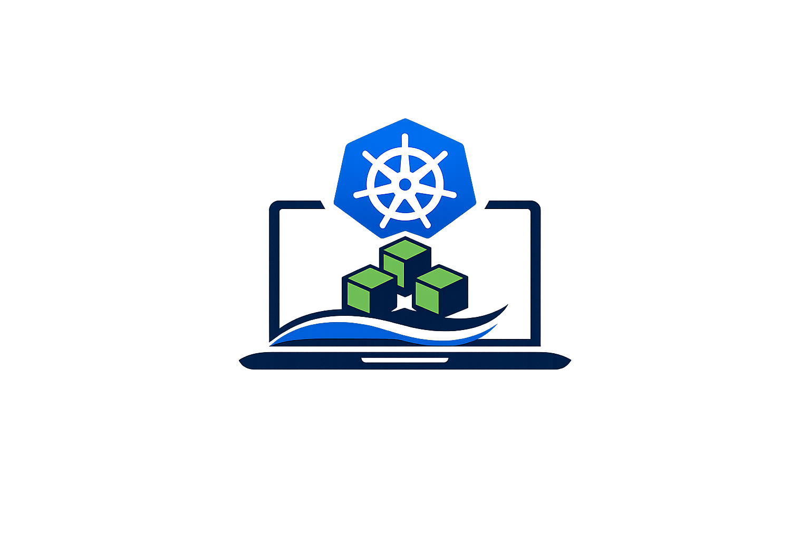
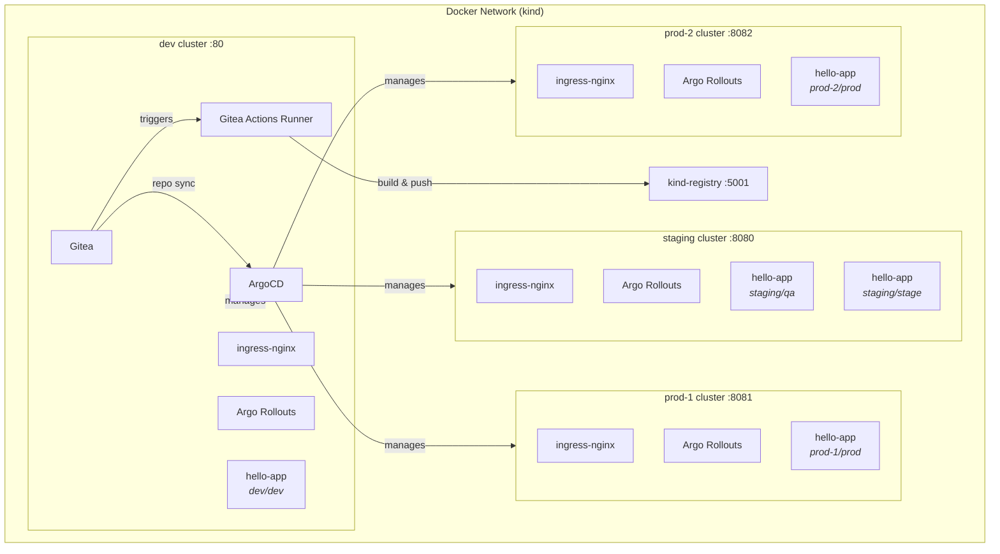

<p align="center">
  
  <br><br>
  <strong style="font-size:1.5em;">IDP — Internal Developer Platform</strong>
  <br>
  <em>A local multi-cluster GitOps platform running on <a href="https://kind.sigs.k8s.io/">kind</a>, managed by <a href="https://argo-cd.readthedocs.io/">ArgoCD</a>.</em>
</p>

## Quick Start

```bash
make run      # create clusters, install infra, activate GitOps
make status   # show platform status
make stop     # stop clusters without losing state
make start    # resume previously stopped clusters
make clean    # tear everything down
```

## Architecture



Four kind clusters simulate a real multi-cluster environment:

| Cluster   | Role                                      | Port    |
| --------- | ----------------------------------------- | ------- |
| `dev`     | Hub — runs ArgoCD, Gitea + Actions runner | `:80`   |
| `staging` | Remote — stage + qa namespaces            | `:8080` |
| `prod-1`  | Remote — prod namespace                   | `:8081` |
| `prod-2`  | Remote — prod namespace                   | `:8082` |

ArgoCD on the dev cluster manages all clusters. Gitea hosts the git repos that ArgoCD watches.

## Repository Structure

```
.
├── scripts/                  # Operational scripts (run, clean, sync, status, stop, start, build)
├── terraform/                # Infrastructure as code (clusters, repositories, modules)
│
├── infrastructure/           # Shared infra bases (Kustomize / Helm)
│   └── <component>/          # e.g. argocd, ingress-nginx, argo-rollouts, gitea, …
│
├── bootstrap/                # One-shot infra per cluster (applied by run.sh)
│   └── <cluster>/            # Kustomization referencing infrastructure/ bases
│
├── applicationsets/          # ArgoCD ApplicationSet declarations
│   └── <component>.yaml      # Git directory generator → clusters/*/*/<component>
│
├── apps/                     # App base manifests (Deployment, Service, Ingress, …)
│   └── <app>/
│
├── clusters/                 # Per-target overlays (ArgoCD's source of truth)
│   └── <cluster>/
│       ├── <component>/      # Infra overlay (e.g. ingress-nginx, argo-rollouts)
│       └── <namespace>/
│           └── <app>/        # App overlay with per-env patches
│
├── projects/                 # Application source code + CI workflows
│   └── <app>/
│
└── Makefile
```

## How It Works

### Setup Flow (`make run`)

0. **Terraform** — provision Docker network, registry, and 4 Kind clusters
1. **Secrets** — generate placeholder `.env` files for cluster credentials and a runner registration token for Gitea Actions
2. **Bootstrap** — build images + apply `bootstrap/<cluster>` in parallel
3. **Wait** — ArgoCD + Gitea rollouts
4. **Credentials** — generate real SA tokens, re-apply cluster secrets
5. **Repos** — provision Gitea repositories via Terraform
6. **Sync** — push IDP repo + projects to Gitea
7. **Activate** — apply root Application that tracks `applicationsets/`

### CI Pipeline

Each project in `projects/` includes a Gitea Actions workflow (`.gitea/workflows/ci.yaml`) that runs on push to `main`. The workflow calls a reusable build-and-push workflow from the IDP repo (`.gitea/workflows/build-and-push.yaml`) that builds a Docker image and pushes it to the local registry (`kind-registry:5000`).

The Gitea Actions runner is deployed as a pod with a DinD (Docker-in-Docker) sidecar on the dev cluster, managed by ArgoCD via the `gitea-actions` ApplicationSet. Runner configuration and DinD daemon config are generated by Kustomize `configMapGenerator` from plain files (`config.yaml`, `daemon.json`). The runner registration token is a shared secret generated at setup time and consumed by both Gitea and the runner via `secretGenerator` in the Gitea kustomization.

### GitOps Loop

The `applicationsets/` directory contains ApplicationSet declarations. Each one uses a **git directory generator** that scans `clusters/*/*/<app>`. The directory path encodes the target:

```
clusters/<cluster>/<namespace>/<app>/kustomization.yaml
```

Each matching directory becomes an ArgoCD Application. The kustomization references a base from `apps/<app>/` and applies per-target patches (replicas, env vars, image tags, ingress hosts).

### Adding a New App

1. Create the base manifests in `apps/<name>/`
2. Create overlays in `clusters/<cluster>/<namespace>/<name>/`
3. Create an ApplicationSet in `applicationsets/<name>.yaml`
4. Run `make sync` to push changes to Gitea

### Adding a New Cluster Target

1. Create `clusters/<cluster>/<namespace>/<app>/kustomization.yaml`
2. Run `make sync` — ArgoCD auto-discovers the new directory

### Platform Status (`make status`)

```
  NAME                                     STATUS             URL                                        CREDENTIALS
  ──────────────────────────────────────── ────────────────── ────────────────────────────────────────── ────────────────────
  argocd                                   Healthy            http://argocd.idp.localhost                admin / ••••••••
  gitea                                    Healthy            http://gitea.idp.localhost                 admin / ••••••••

  argo-rollouts
  argo-rollouts-argo-rollouts-dev          Synced/Healthy     -                                          -
  argo-rollouts-argo-rollouts-prod-1       Synced/Healthy     -                                          -
  argo-rollouts-argo-rollouts-prod-2       Synced/Healthy     -                                          -
  argo-rollouts-argo-rollouts-staging      Synced/Healthy     -                                          -

  gitea-actions
  gitea-actions-gitea-dev                  Synced/Healthy     -                                          -

  hello-app
  hello-app-dev-dev                        Synced/Healthy     http://hello-app.dev.idp.localhost         -
  hello-app-prod-prod-1                    Synced/Healthy     http://hello-app.prod.idp.localhost:8081   -
  hello-app-prod-prod-2                    Synced/Healthy     http://hello-app.prod.idp.localhost:8082   -
  hello-app-qa-staging                     Synced/Healthy     http://hello-app.qa.idp.localhost:8080     -
  hello-app-stage-staging                  Synced/Healthy     http://hello-app.stage.idp.localhost:8080  -

  ingress-nginx
  ingress-nginx-ingress-nginx-dev          Synced/Healthy     -                                          -
  ingress-nginx-ingress-nginx-prod-1       Synced/Healthy     -                                          -
  ingress-nginx-ingress-nginx-prod-2       Synced/Healthy     -                                          -
  ingress-nginx-ingress-nginx-staging      Synced/Healthy     -                                          -
```

## Commands

| Command       | Description                                           |
| ------------- | ----------------------------------------------------- |
| `make run`    | Provision infrastructure and activate GitOps          |
| `make stop`   | Stop clusters without losing state (docker stop)      |
| `make start`  | Resume previously stopped clusters (docker start)     |
| `make clean`  | Destroy all infrastructure (terraform destroy)        |
| `make sync`   | Push repos to Gitea                                   |
| `make status` | Show platform status                                  |
| `make help`   | List all targets                                      |

## Prerequisites

- [docker](https://docs.docker.com/get-docker/)
- [kind](https://kind.sigs.k8s.io/)
- [kubectl](https://kubernetes.io/docs/tasks/tools/)
- [kustomize](https://kubectl.docs.kubernetes.io/installation/kustomize/)
- [helm](https://helm.sh/docs/intro/install/)
- [terraform](https://developer.hashicorp.com/terraform/install)
- curl, git
